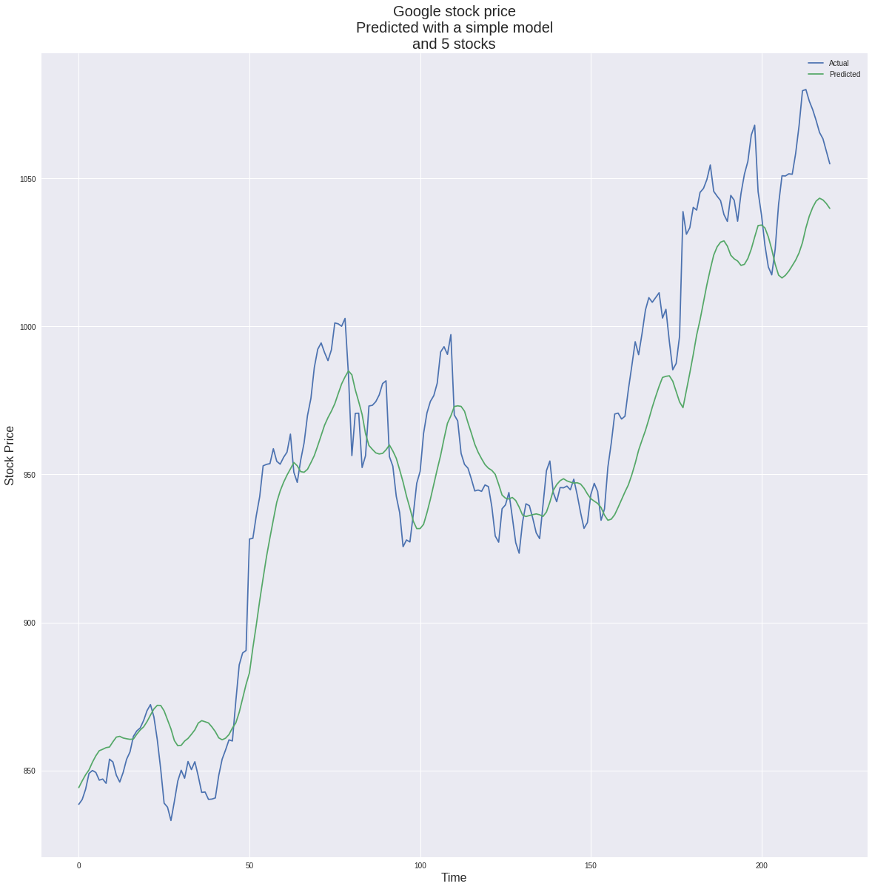
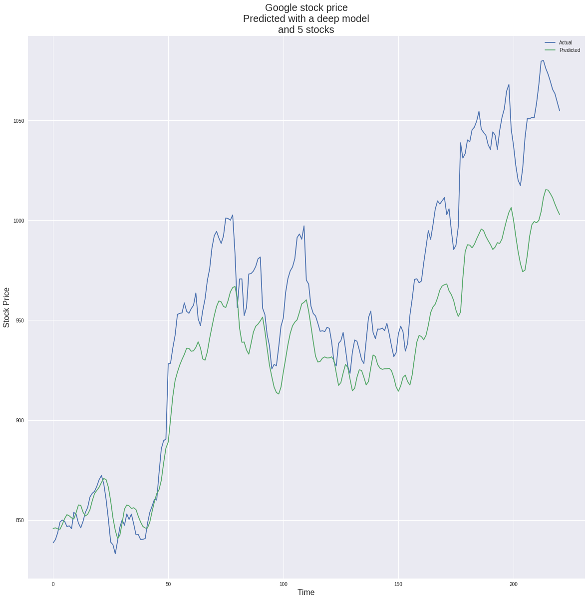

# Predicting Stock Prices using Neural Networks
By: Elias Carciente, Pat Hottovy, and Jim McGugan

When deciding a topic for this case study, we were immediately drawn to the Kaggle stock price dataset. Yes, this was definitely our first choice for a project.

## Overview

After our pivot at around 11am, our main priority was to build a working model. Due to our self imposed time constraints, we decided to use tips from other Kaggle users to clean our dataset as quick as possible so we could focus on building the model and analyzing our results.

## Model

For our predictions, we used LSTM to build a recurrent neural network. Instead of using all 30 companies in the dataset, we built our model using smaller samples of the companies.

## Process

Once we had clean data, each member of the group chose a different area to focus on.
* Jim focused on optimizing a model using Google stock as a baseline.
* Elias tried to perform the same prediction, but using additional stocks to give more information to de predictor.
* Pat focused on analyzing the data using more conventional methods.

## Interpretations

Pat began by looking for relationships between the stock prices and comparing the growth of the companies.

Jim initially used Google's stock to build and tune his model.

Elias focused on technology stocks to see how grouping companies from similar industries impacted our predictions. Guessing that good performers might have some correlation, the experiment included the two best and the two worst performers, to balance correlation with relevance.

## Final Analysis
* When picking a topic, ask yourself "Does this data have available target data?"
* Know when to cut your losses and pivot!
* And most of all, have fun!
